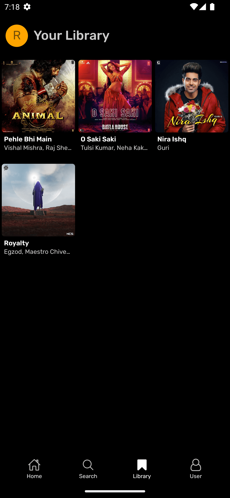
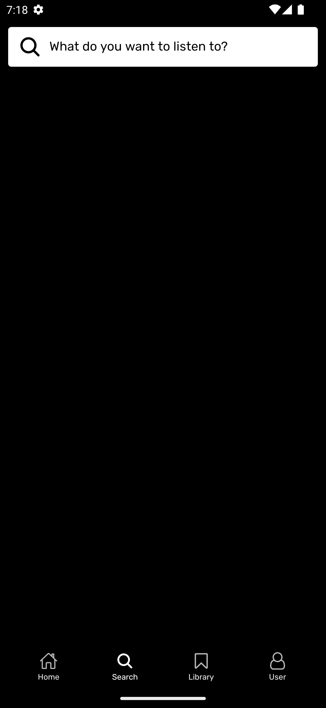
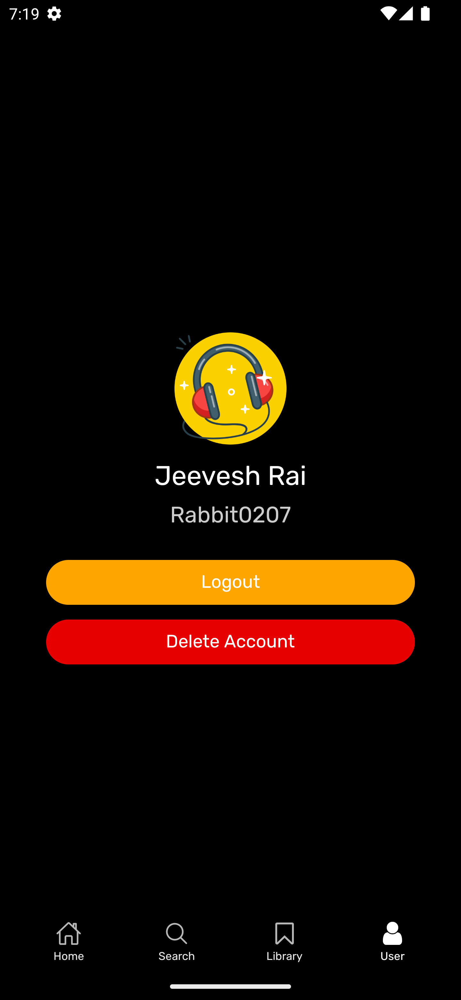

    
    <h1>Melody Music</h1>
    
Introducing Melody Music, your ultimate destination for an immersive and limitless music experience on Android! Immerse yourself in a world of unlimited tunes, seamlessly curated for your every mood and moment.

---

  
  
  

  
  
  

## 🎵 GrooveHub - Your Ultimate Music Experience 🎧
- 🆓 Totally Free
- 🎶 Unlimited Songs
- 📥 Download Tracks
- ❤️ Add to Favorites
- 📃 With Lyrics
- ⏯️ Playback Control
- 🔍 Search Any Song
- 🎨 Dynamic Background
- 🎶 Artist Playlists
- 🎉 And Many More 🚀

## Download

## Disclaimer
This project and its contents are not affiliated with, funded, authorized, endorsed by, or in any way associated with YouTube, Google LLC or any of its affiliates and subsidiaries.

Any trademark, service mark, trade name, or other intellectual property rights used in this project are owned by the respective owners.
